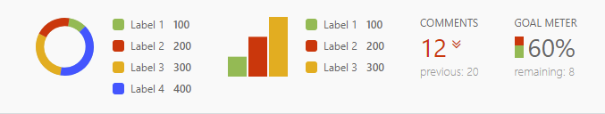

# Charts plugin

Provides charts and scoreboard functionalities for OctoberCMS.



## Available widgets

### Pie chart

```php
$pieChart = new PieChart($this);
$pieChart->data = [
    ['label' => 'Label 1', 'value' => 100], 
    ['label' => 'Label 2', 'value' => 200], 
    ['label' => 'Label 3', 'value' => 300],
    ['label' => 'Label 4', 'value' => 400]
];
$pieChart->cssClasses = ['scoreboard-item'];
$pieChart->bindToController();
```

### Bar chart

```php
$barChart = new BarChart($this);
$barChart->data = [
    ['label' => 'Label 1', 'value' => 100], 
    ['label' => 'Label 2', 'value' => 200], 
    ['label' => 'Label 3', 'value' => 300]
];
$barChart->cssClasses = ['scoreboard-item'];
$barChart->bindToController();
```

### Line chart

```php
$lineChart = new LineChart($this);
$lineChart->data = [
    ['x' => 1477857082000, 'y' => 400], 
    ['x' => 1477943482000, 'y' => 380], 
    ['x' => 1478029882000, 'y' => 300]
];
$lineChart->xAxisOptions = [
    'mode' => 'time'
];
$lineChart->cssClasses = ['scoreboard-item', 'w-300'];
$lineChart->bindToController();
```

### Title value

```php
$titleValue = new TitleValue($this);
$titleValue->title = 'Comments';
$titleValue->value = 12;
$titleValue->previousValue = 20;
$titleValue->showTrend = true;
$titleValue->cssClasses = ['scoreboard-item'];
$titleValue->bindToController();
```
### Goal meter

```php
$goalMeter = new GoalMeter($this);
$goalMeter->title = 'Goal meter';
$goalMeter->value = 12;
$goalMeter->goal = 20;
$goalMeter->cssClasses = ['scoreboard-item'];
$goalMeter->bindToController();
```

### Scoreboard

This is a meta widget that can be used as a container for multiple chart widgets. It integrates nicely with the default list markup.

```php
$charts = [
    'piechart' => [
        'data' => [
            ['label' => 'Label 1', 'value' => 100], 
            ['label' => 'Label 2', 'value' => 200], 
            ['label' => 'Label 3', 'value' => 300]
        ],
        'type' => 'piechart'
    ],
    'barchart' => [
        'data' => [
            ['label' => 'Label 1', 'value' => 100], 
            ['label' => 'Label 2', 'value' => 200], 
            ['label' => 'Label 3', 'value' => 300]
        ],
        'type' => 'barchart'
    ],
    'titlevalue' => [
        'title' => 'Comments',
        'value' => 12,
        'previousValue' => 20,
        'showTrend' => true,
        'type' => 'titlevalue'
    ]
];
$scoreboard = new ScoreBoard($this);
$scoreboard->charts = $charts;
$scoreboard->bindToController();
```

## Render the widget

Once bound to the controller, the widget can be rendered from a controller partial using the `$widget` property as the alias of the widget. In the examkple below we rely on the default aliases, however, they can be changed as liked.

```html
<div class="scoreboard">
    <div data-control="toolbar">
        <?= $this->widget->pieChart->render() ?>

        <?= $this->widget->barChart->render() ?>

        <?= $this->widget->lineChart->render() ?>

        <?= $this->widget->titleValue->render() ?>

        <?= $this->widget->goalMeter->render() ?>
    </div>
</div>
```

## Behaviors

For easy integration with a controller, a behavior is provided that can be configured by a YAML configuration file.